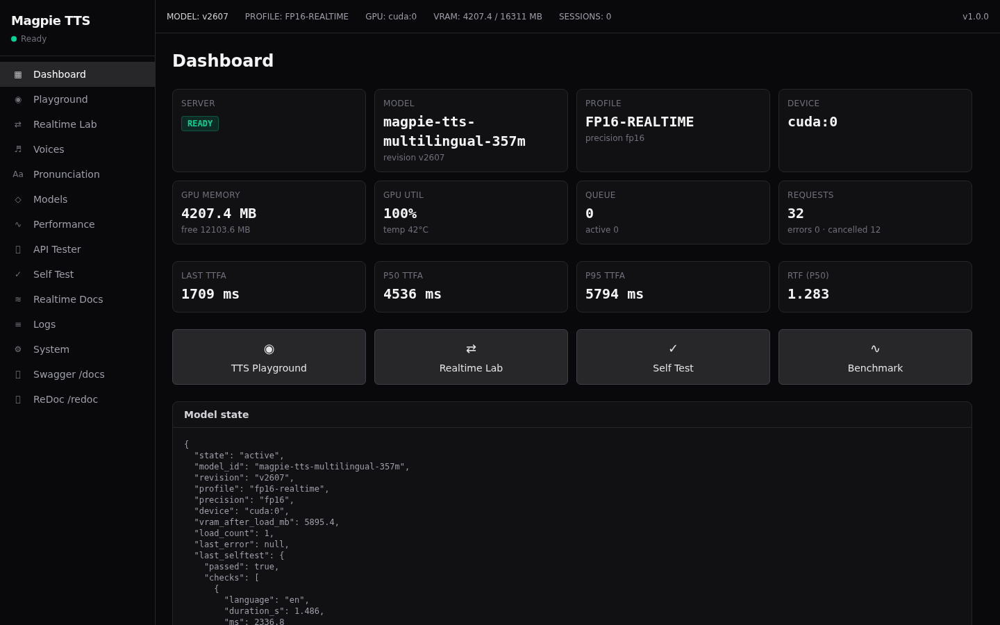
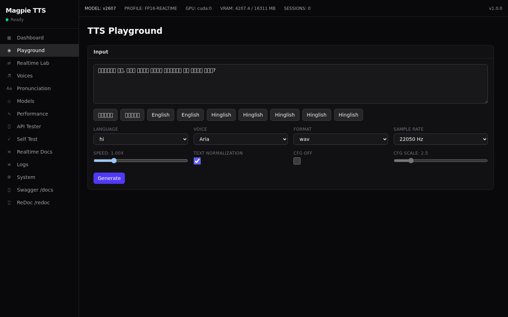

<div align="center">

# Magpie TTS Server

**A self-hosted, realtime, multilingual text-to-speech API server powered by NVIDIA Magpie TTS.**

OpenAI-compatible REST · NVIDIA-style WebSocket streaming · 12 languages · 5 voices · low-latency phrase streaming · built-in testing GUI

<p align="center">
  <a href="#quick-start"></a>
  <a href="https://www.apache.org/licenses/LICENSE-2.0"></a>
  
  
  
  
  
</p>



</div>

---

## What is this?

**Magpie TTS Server** is a self-contained, self-hosted **text-to-speech (TTS) API server** built on
[NVIDIA's MagpieTTS Multilingual 357M](https://huggingface.co/nvidia/magpie_tts_multilingual_357m) model
(v2607) running inside [NVIDIA NeMo](https://github.com/NVIDIA/NeMo).

It turns a single GPU into a production-ready **voice endpoint** that is:

- **OpenAI-compatible** — drop-in replacement for the `audio.speech` API.
- **Realtime** — NVIDIA-style WebSocket streaming with phrase-level synthesis and barge-in cancellation.
- **Multilingual** — English, Hindi, Hinglish (code-mixed), Arabic, Chinese, French, German, Italian,
  Japanese, Korean, Portuguese, Spanish, Vietnamese.
- **Low-latency** — streams speech phrase-by-phrase, so voice agents don't wait for a full LLM reply.
- **Self-hosted** — the model loads once and stays resident; your audio never leaves your network.

It is designed for **voice AI agents**, **call centers**, **IVR systems**, and any app that needs
**realtime, low-latency, multilingual speech synthesis** on your own hardware.

---

## Features

- 🎙️ **OpenAI-compatible REST API** — `POST /v1/audio/speech` (with `stream=true`), `GET /v1/models`,
  `GET /v1/audio/voices`, and `POST /v1/audio/cancel`.
- ⚡ **Realtime WebSocket** — `ws://HOST:8092/v1/realtime?intent=synthesize` with token-by-token
  `input_text.append`, phrase buffering, and `response.cancel` barge-in.
- 🌐 **12 languages, 5 voices** — code-switching (Hinglish) handled out of the box.
- 🧩 **Native advanced API** — `POST /api/tts/generate` exposes CFG guidance, text normalization,
  long-form mode, pronunciation dictionary, and priority scheduling.
- 🎚️ **Safe model switching** — hot-swap FP32 / FP16 / BF16 profiles with drain → unload → load → warmup →
  self-test → rollback on failure.
- 📊 **Observability** — Prometheus-compatible `/metrics`, live GPU metrics, TTFA/RTF stats.
- 🖥️ **Built-in testing GUI** — Dashboard, Playground, Realtime Lab, Voice Matrix, Benchmark Lab,
  API Tester, and a 24-check self test. All served from the same `:8092` port.
- 📦 **Production-ready** — `systemd` unit and Docker image, no authentication (LAN appliance design).



---

## Quick start

The one-liner installer handles everything — Python venv, PyTorch, NeMo, model download, GUI build,
and a `systemd` service:

```bash
git clone https://github.com/kobidkunda/MagpieTTS.git
cd MagpieTTS
./scripts/install.sh
```

Then open **http://YOUR_GPU_HOST:8092** for the GUI, and **http://YOUR_GPU_HOST:8092/docs** for Swagger.

### Manual install

```bash
python3 -m venv .venv && source .venv/bin/activate
pip install torch --index-url https://download.pytorch.org/whl/cu128
pip install "nemo_toolkit[tts]@main" kaldialign
pip install -r requirements.txt
bash scripts/download-model.sh
(cd web && npm install && npm run build)
uvicorn app.main:app --host 0.0.0.0 --port 8092 --workers 1
```

> **Important**: always run with `workers=1`. The model must load exactly once and be shared by all clients.

### Requirements

| Component | Minimum |
|-----------|---------|
| GPU       | NVIDIA (tested on RTX 5060 Ti 16 GB, CUDA 13.0 driver) |
| Python    | >= 3.10.12 |
| Node      | >= 20 (GUI build only) |
| ffmpeg / PyAV | optional — for `mp3`/`opus`/`flac`/`aac` transcoding |

---

## Usage

### OpenAI SDK (drop-in)

```python
from openai import OpenAI

client = OpenAI(base_url="http://your-gpu-host:8092/v1", api_key="unused")

resp = client.audio.speech.create(
    model="magpie-tts-multilingual-357m",
    voice="aria",
    input="आपका order dispatch हो गया है।",
)
open("out.wav", "wb").write(resp.content)
```

### REST (cURL)

```bash
curl -X POST http://your-gpu-host:8092/v1/audio/speech \
  -H "Content-Type: application/json" \
  -d '{"model":"magpie-tts-multilingual-357m","input":"Hello world","voice":"aria","response_format":"wav"}' \
  --output hello.wav
```

### Realtime WebSocket (streaming voice agent)

```python
import asyncio, json, websockets

async def main():
    async with websockets.connect("ws://127.0.0.1:8092/v1/realtime?intent=synthesize") as ws:
        print(await ws.recv())  # session.created
        await ws.send(json.dumps({"type": "session.update", "session": {
            "voice": "aria", "language": "hi", "format": "pcm", "sample_rate": 22050}}))
        print(await ws.recv())  # session.updated

        # Stream tokens as your LLM produces them
        for tok in ["जी ", "सर, ", "आपका ", "order ", "dispatch हो चुका है।"]:
            await ws.send(json.dumps({"type": "input_text.append", "text": tok}))
        await ws.send(json.dumps({"type": "input_text.commit"}))

        while True:
            msg = json.loads(await ws.recv())
            if msg["type"] == "audio.chunk":
                ...  # decode base64 PCM, play immediately
            elif msg["type"] == "response.completed":
                break

        await ws.send(json.dumps({"type": "response.cancel"}))  # barge-in

asyncio.run(main())
```

---

## API surface

| Method | Path | Purpose |
|--------|------|---------|
| POST | `/v1/audio/speech` | OpenAI-compatible TTS (`stream=true` supported) |
| POST | `/v1/audio/cancel` | Cancel queued synthesis (barge-in) |
| GET  | `/v1/models` | Model list |
| GET  | `/v1/audio/voices`, `/v1/audio/list_voices` | Voice discovery (OpenAI + NVIDIA styles) |
| GET  | `/api/languages` | Supported languages |
| POST | `/api/tts/generate` | Native advanced TTS (CFG, TN, long-form, priority) |
| GET/POST/DELETE | `/api/tts/pronunciation` | IPA pronunciation dictionary |
| GET  | `/api/profiles` | Precision profiles + measured VRAM |
| POST | `/api/profiles/switch` | Safe precision profile switch |
| POST | `/api/selftest` | 24-check full self test |
| POST | `/api/benchmark` | Benchmark lab |
| GET  | `/api/system` | Full system status |
| GET  | `/health`, `/ready` | Liveness / readiness probes |
| GET  | `/metrics` | Prometheus-compatible metrics |
| WS   | `/v1/realtime?intent=synthesize` | Realtime streaming TTS |
| GET  | `/docs`, `/redoc`, `/openapi.json` | Interactive API docs |

See **[docs/API.md](docs/API.md)** for full request/response schemas and **[docs/REALTIME.md](docs/REALTIME.md)**
for the complete WebSocket protocol.

---

## Languages & voices

**Languages** (12): Arabic `ar`, Chinese `zh`, English `en`, French `fr`, German `de`, Hindi `hi`,
Italian `it`, Japanese `ja`, Korean `ko`, Portuguese `pt`, Spanish `es`, Vietnamese `vi`.

**Voices** (5): `aria`, `jason`, `john`, `leo`, `sofia`.

Code-mixed speech (e.g. Hinglish) is supported natively — `"आपका order dispatch हो चुका है।"` just works.

---

## Architecture

```text
                 ┌──────────────────────────────────────────────┐
                 │              Magpie TTS Server  (:8092)      │
                 │                                              │
  OpenAI SDK ───►│  OpenAI-compatible REST  ─┐                  │
  REST client ──►│  Native Magpie REST       ┼──► Scheduler ──► │
  LLM tokens ───►│  WebSocket realtime       ┘        │         │
                 │                                    ▼         │
                 │              ONE resident MagpieTTSModel      │
                 │              (FP32 / FP16 / BF16 profiles)   │
                 │                                    │         │
                 │                      NanoCodec → PCM 22.05kHz │
                 └──────────────────────────────────────────────┘
```

- **Single model process** (`workers=1`) shared by HTTP, WebSocket, and GUI clients.
- **Phrase streaming engine** buffers incoming tokens and synthesizes at sentence boundaries, giving
  low time-to-first-audio (TTFA) without waiting for a full response.
- **Priority scheduler** keeps live voice-agent streams ahead of GUI tests and benchmarks.

---

## Performance

| Profile | Precision | Purpose |
|---------|-----------|---------|
| `fp16-realtime` | FP16 | Default — low VRAM (~0.9 GB inference), fast |
| `fp32-reference` | FP32 | Reference quality, highest VRAM/latency |
| `bf16` | BF16 | Benchmarked alternative |

The GUI **Benchmark Lab** measures TTFA (P50/P95/P99), real-time factor (RTF), peak VRAM, and GPU
utilization for each profile — so precision choices are based on measurements, not assumptions.

---

## Deployment

**Primary**: `systemd` + Python venv (unit installed as `magpie-tts.service`).

```bash
sudo systemctl restart magpie-tts
sudo journalctl -u magpie-tts -f
```

**Alternative**: Docker (`docker/`).

---

## Security

This is a **LAN appliance**: no authentication, binds `0.0.0.0`. Restrict firewall access to your
application network, since the GUI includes administrative operations (model switching, benchmarks).
See **[SECURITY.md](SECURITY.md)**.

---

## Project layout

```
app/       FastAPI backend (api, schemas, engines, runtime, audio, text, adapters)
web/       React + Vite + Tailwind GUI (served by FastAPI)
configs/   server.yaml, profiles.yaml, voices.yaml, pronunciation.yaml
models/    downloaded .nemo checkpoints (not committed)
scripts/   install.sh, update.sh, download-model.sh, test.sh, benchmark.sh
docs/      API reference, WebSocket protocol, screenshots
docker/    Dockerfile + docker-compose.yml
tests/     pytest unit tests
```

---

## Contributing

Contributions are welcome! See **[CONTRIBUTING.md](CONTRIBUTING.md)**.

## License

- Server code: **Apache-2.0** ([LICENSE](LICENSE))
- Model: [NVIDIA Open Model License](https://huggingface.co/nvidia/magpie_tts_multilingual_357m)

---

## Related

- [NVIDIA NeMo](https://github.com/NVIDIA/NeMo) — the toolkit this server wraps.
- [MagpieTTS Multilingual 357M](https://huggingface.co/nvidia/magpie_tts_multilingual_357m) — the model checkpoint.

---

<div align="center">

**⭐ If you find this useful, give it a star!** ⭐

</div>
